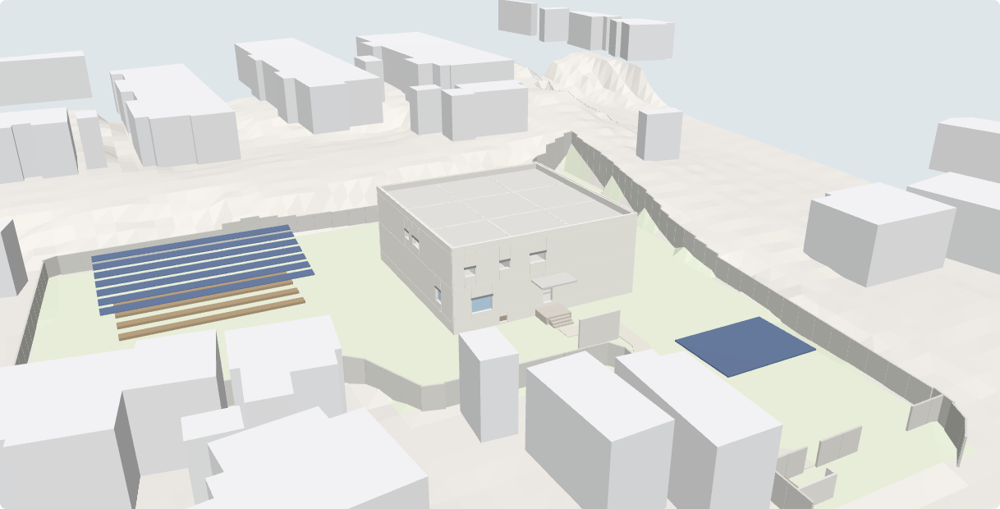

# 河沿要（仮称）— 壁式RC造 2階建て専用住宅：基本計画図・法規チェック・3Dモデル

八王子市大和田町7丁目（ひよどり山トンネル南口の西、A3（エースリー）店舗とその西側駐車場の土地）に計画する住宅の基本計画です。
設計条件は [`docs/kawazanyo_design_brief_v3.md`](docs/kawazanyo_design_brief_v3.md)（v2 から敷地・高低差・外構を更新）と、その数値版の [`spec.yaml`](spec.yaml) にまとめています。



## 敷地の推定（v3 で更新）
| 項目 | 値 |
|---|---|
| 敷地面積 | **約2,772m²（839坪）**。推定誤差 ±5%程度、要測量 |
| 方法 | 国土地理院 基盤地図情報の道路縁・水涯線（北・東・南の境界）＋施主加筆線（西・北西・南西）＋隣接建物からの推定線（南西の一部）。図: [`docs/site_estimate.png`](docs/site_estimate.png) |
| 高低差（DEM5A） | 敷地 TP+109.3〜109.6m／南側道路 109.0m／北側道路 112.5〜113.0m／東側道路 109.0→112.9m。**北・東の方が高い** |
| データ | [`data/site_gsi.json`](data/site_gsi.json)（道路縁・水路・周辺建物・等高線・2mグリッドの標高） |

## 間取り（v3.1）
回遊動線（1階2ルート・2階2ルート、階段2か所）、家事動線（キッチン→パントリー→ランドリー→ファミリークローゼット、階段2で2階ファミクロへ直結）、防音ゾーニング（ジム1階・シアター2階を南東に上下で集約し、機械室・前室・WIC を緩衝帯にする）を優先して計画。ジムは 45.7m²（従前の1.32倍）。詳細はブリーフ v3 第9章。

v3.2: 2階も全窓 FIX ＋機械排煙（開口部・排煙計画は A-10）。ジムは外部扉を廃止して FIX 高窓（防犯合わせガラス）に変更し、搬入は玄関から（二重框を上がってホールで右折し、遮音ドアからジムへ。段差解消機・SIC なし）。ジムの機器は商業ジム相当を想定。太陽光は駐車場のカーポートのみで、屋根には設置しない。

v4（B案）: 内寸18.0m角（壁芯 6.125／6.0／6.125）。冷暖房負荷・耐震性・必要発電量の概算（M-01・S-03）を追加し、全室 通年の室内環境目標（湿度55〜60%、夏25〜26℃、冬20〜21℃）で負荷を算定。太陽光は本館と分離した日よけ付き菜園（ソーラーパーゴラ 180m²、約27kWp）に設置し、3台用ソーラーカーポートを併設し、パーゴラの被覆率と影による損失を補う（合計 約37kWp）。玄関は本館から独立した自立壁1枚（L4.4m・H2.7m）で南側道路から隠し（視線判定 0/17 地点）、出2.0mの庇を設ける。東西は開放。

v4.4: 建物・外構を南側道路に平行・直交させた（真東西から12.3°回転）。日射取得・発電量を方位別に再計算した（M-02）。
v4.5: 全窓を樹脂サッシ＋Low-E トリプルガラスに統一し、紫外線対策（UVカット合わせガラス・南東西の外付け電動ブラインド）を追加した（M-03）。
v4.6: インテリアを「安全」「清掃・メンテナンスが簡易」で統一（I-01 内装設計方針・I-02 内装仕上表）。階段まわりをすき間のない手すり壁とし、外付けの日よけを羽根のない ZIP スクリーンに変更した。
v4.7: 家具は突っ張り式（RC 壁に固定しない）、床清掃は掃除ロボット、タンク式便器。スクリーン・照明・空調・ロボットを bot から操作できる制御（E-02）、調光・調色 LED、Wi-Fi 電波計画（E-01）、外構の防虫計画（E-03）を追加した。

## 生成物（`dist/`）
- `drawings.pdf`：A3 全17枚、`dxf/*.dxf`：CAD 用、`png/`：画像
  - A-00 表紙／A-01 配置図・求積図（座標求積）／A-02 外構・雨水排水計画図／A-03・04 平面図／A-05 屋根伏図／A-06 立面図／A-07 断面図（建物）／A-08 敷地断面図（地形・浸水）／A-09 建具表／A-10・11 法規チェックリスト／S-01 基礎伏図・耐力壁配置図（壁量）／S-02 RC塀・止水・透水舗装 詳細図
- `model.glb`：3Dモデル。建物、RC塀、Dotcon+ 舗装、カーポート、周辺建物、地形を含む
- `LEGAL_CHECK.md`：法規チェック 59項目。不適合0、要確認12（用途地域・防火指定・採光補正係数・2階の排煙・構造計算など）
- ビューア: [`index.html`](index.html)。3D表示、断面表示、図面一覧、法規チェック表を見られます

## 再生成
```
pip install ezdxf matplotlib shapely trimesh pyyaml mapbox_earcut
python3 src/build.py
```

## ソース構成
- `src/house.py`：住宅モデル（壁式RC・諸室・開口・階段・敷地・外構）
- `src/house_sheets.py`・`src/sheetlib.py`・`src/cadlib.py`：図面（JIS A 0150 の線の使い分け、モデル空間 1:1・mm、A-/S-/G- レイヤ）
- `src/views.py`：3D の部材を切断・投影して、隠れる線を消しながら平面・立面・断面を作図
- `src/house_legal.py`：法規チェック（建築基準法・施行令・平13国交告1026号・東京都建築安全条例ほか）
- `src/model3d.py`：glTF 出力

## 注意
敷地面積・高低差は公開データからの推定です。用途地域は準工業地域と推定しており、確認が必要です。測量・地盤調査・構造計算・行政協議（水路の占用、がけ条例、雨水浸透）による確定が必要です。
